****************
FPGA Development
****************

Introduction
############
I rarely see projects that document **all** the trials and tribulations of FPGA and digital design developement.  
Before I began I was always looking for tutorial on 'how a digital design project develops'.
How do you structure a project?
How do you write the testbenches?
What is the order the pieces get developed?
I have written a couple of software projects, nothing that took off, but atleast I had a concept of how to get started.
For hardware I was not sure.
I wanted a *build journal* of sorts for an FPGA project.
The closest thing I found was the `Ettus Reasearch USRP <https://github.com/EttusResearch/UHD-Mirror>`_ verilog source code.  
Staring at the USRP verilog source long enough you get a bit of a feel for how it evolved. 
So I plan to do a **really** good job here of documenting not only the project but also the *design process*.
It might be useful to someone someday.
It should be known that I am very new to digital design and hopefully other *noobs* will find this useful.

Additonal Resources
###################
The best resource I have is the textbook `Digital Design and Computer Architechture <http://textbooks.elsevier.com/9780123704979>`_ by David Money Harris & Sarah L. Harris.  
I *really* like this book.  
The style of text is very approachable.  
The examples are all done in *BOTH* Verilog and VHDL and therefore you can get a feel for both HDLs.

A close runner up and essential resource once you want to get your designs on to an FPGA is the free `textbook <http://www.xess.com/appnotes/FpgasNowWhatBook.pdf>`_ publised on the `XESS website <http://www.xess.com/index.php>`_.  Dave Vandenbout provides a tutorial of how to get your designs on to his XuLA board and through the process teaches you how to use the Xilinix tools.  If  you want to write a textbook on FPGAs this is how you do it!  One note is that all the code is written in VHDL and I plan to use Verilog.

Verilog vs VHDL
###############
Let's be clear, I do **not** have enough experience to help you choose a hardware description language (HDL).  
I started working through tutorials in VHDL, but decided that I like the Verilog syntax better and switched. 
My labmate also *recommended* Verilog. These are the only reasons I chose Verilog.  From here on out I will use Verilog.

Choosing a Development Board
############################
This is probably one of the hardest decisions to make.  
There are **ALOT** of development boards on the market.  
Some have periphreals up the wazoo.  
While some are fairly barebone with only enough supporting circuitry to run the FPGA.
Others have advanced FPGAs with MILLIONS of gates. I looked a along time.
Whatever board I choose I would need to be able to layout the FPGA chip later for my own device, so open source schematics were advantageous.
I began developing with microcontrollers on the Arduino, so I also wanted something with a community.  Documentation is a must!
Generally the more users the better the documentation and examples.
In the end I chose two boards, there is very little difference between them as they are both based upon Spartan-3 FPGAs.

XESS XuLA-200
*************
The form factor of the `XuLA-200 <http://www.xess.com/prods/prod048.php>`_ is awesome.  
Those familiar with the 2 inch by 1 inch `mbed <http://mbed.org/>`_ will feel right at home. Its breadboard ready!
The other **BIG** advantage was the book `FPGSs!? Now What? <http://www.xess.com/appnotes/FpgasNowWhatBook.pdf>`_ because clearly Dave knows how to right a book on FPGAs.
With 200,000-gates it should not be hard for me to fit my fairly simple Platypus DAQ design onto the chip.  
The other nice selling point was the lack of a need for a programmer.  
A Microchip PIC microcontroller does all the hard work of getting the Xilinix tools generated bitstream from the host over USB to the Xilinix FPGA.
The drag and drop style of the XuLA tools GUI is also very nice (although I eventually moved to the commandline interface for efficiency reasons).

Gadget Factory Papilio One 500k
*******************************
The `Papilio One <http://www.gadgetfactory.net/papilio/>`_ is another one of those *GeeWiz* cool products I was first introduced to on `Hackaday <http://hackaday.com/>`_.  
The Papilio One is a bigger FPGA with 500,000 logic gates meaning it can hold a much larger designs.
The `Wiki <http://www.gadgetfactory.net/papilio-wiki/>`_ includes examples of running entire SOC(system on a chip) designs on the Papilio.
The most notable SOC design is the AVR8 IP Core that allows you to run Arduino sketches (I Know! Awesome).
Other attractive features about this board are the fact that it looks like a community is *trying* to form.  
Programming this board does not require a programmer, as it uses the FT2232 IC.
I am familiar with the FTDI chip I plan to duplicate this topology in my own Platypus DAQ design for programming the FPGA.

Choosing the FT2232H
####################
The Platypus DAQ will be capable of sampling data with 16-bit resolution across 64 channels
at a rate of 200kSps.  The required data rate is then ~25.6 MBytes/sec. 
USB *full-speed* is supported by most microcontrollers, but USB *full-speed* can only 
stream data at a maximum rate of 11Mbps. This is not enough for our application.  
USB High-speed, which can transfer data at 480Mbps (60MBytes/sec), 
is supported by some high-end microcontrollers but would require the developement of both microcontroller
firmware and usb driver.   To avoid this development an alternate device was selected.
The FT2232H USB UART & FIFO chip is capable of transmitting data at rates up to
60MBytes/s according to the documentation. This is by definition *High Speed* USB (~480Mb/s).    
To achieve this **high** rate of data transfer it is necessary to put the IC in to synchronous FT245 Mode.
Later on should I choose to use a microcontroller with a High-speed USB periphreal porting the code should
be straightforward.

Simulating the FT2232H
######################
Why Develope a Testbench?
*************************
Complex digital systems require thorough testing and debugging (atleast they should) before they can be *released* into the *wild*. 
It is essential for the Platypus DAQ, a system that will later be submerged underwater and mounted to a robotic arm to function as expected *all of the time*.
Additionally, working digital models of the periphreal chip interfaces can reduce development times allowing the simulation of **full** system
before I ever layout a circuit.  Plus, looking at digital waveforms is just fun. Right?!?

Modeling the FT2232H TX in Verilog
**********************************
When developing the simulation for the functioning FT2232H it is important to study the datasheet.  
You can download the FT2232H datasheet `here <http://www.ftdichip.com/Support/Documents/AppNotes/AN_130_FT2232H_Used_In_FT245%20Synchronous%20FIFO%20Mode.pdf>`_.  
The most important data for developing the simulator were in section 3.2, describing the FT2232H Pin descriptions;
section 4.4, showing the IO timing requirements and 
figure 4.4, showing the signal waveforms for interfacing with the FT2232H in Synchronous FIFO mode.

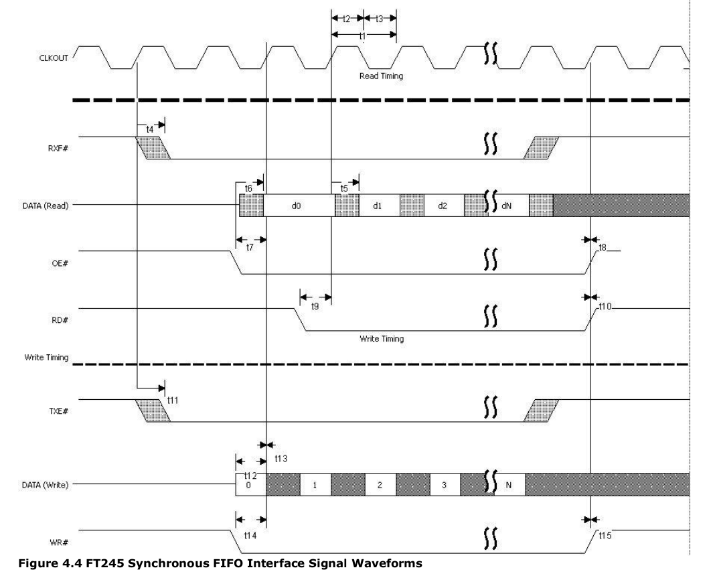

   Figure from datasheet showing the expected signal wave forms for synchronous mode
   
From the timing diagram, when TXE# goes low the interfacing device is allowed to send data.
At this point when data is available for transmission to the host our device can lower WR# and place the byte on D0...D7.
From section 3.4.3 WR# - "Writes the data byte on D0...D7 pins in to the transmit FIFO buffer when WR# is low.
The next FIFO data byte is written to the transmitt FIFO buffer each CLKOUT cycle until WR# goes high".  From timing diagram, the FT2232H 
loads the byte into its transmit FIFO on CLKOUT low.  Lets write some verilog to mimic this action.  
This is the contents of src/ft2232h_tx.v :

.. code-block:: verilog
        :linenos:
        
        `timescale 1ns/1ps

        `define LO     0
        `define HI     1

        module ft2232h_tx(
        data,
        wr_i,
        clkout_i,
        txe_i
        );

        input [7:0] data;
        input wire wr_i;
        input wire txe_i;
        input wire clkout_i;

        integer outfile;

        // Setup TX Process
        initial begin
                $timeformat(-9, 2, "ns", 6);
                outfile = $fopen("testbench/toPc.tv", "w");
        end

        // TX Process
        always @ (clkout_i) begin
                if (!clkout_i &(txe_i == `LO) && (wr_i == `LO)) begin
                        $fwrite(outfile,"%x\n", data);
                        $display("  TX to PC:\t %t \t%H",$realtime, data); 
                end
        end

        endmodule       

The verilog code is very simple.  First (line 25) we open a file to write to.
Then using an always block (line 29) we wait on changes to clkout_i.  
It clkout_i goes low while both txe_i and wr_i are low then we write the 8bit value in data to a file as well as printing
it to the console (lines 31 & 32).

Modeling the FT2232H RX in Verilog
**********************************
While we are simulating the actions of hardware we should also model the receive side of the FT2232H.  
It is important to note that these models are only used for simulation.
Creating the models one faciliates easier development of our FPGA application and testing of our code *off-line*.

Lets take a look at the FT2232 synchronous mode waveforms

   Figure from datasheet showing the expected signal wave forms for synchronous mode

Immeadiately it is clear that the receice portion of the FT2232H is more complicated to simulate than the transmit portion.  
There are a couple reasons for this.  

First, looking at the signal waveforms for.. code-block:: bash

        $ sudo port install iverilog gtkwave receiving data. It is clear there are more
signals to manage than on the transmit side.  Our simulator must control RXF#, informing our device when data is available.
It must also monitor OE#, allowing either the FT2232H or the external device to drive the data bus.
The RD# signal controls when the memory pointer will advance forward.

Second and more importantly, the receive component **has** to be asynchronous.  
We do not know when a user will send a signal from the outside world to our device and this requires *something* that can
link these different *clock* domains.  To accomplish this I used something called a `FIFO <http://en.wikipedia.org/wiki/FIFO>`_.  
For those computer scientists this term should be very familiar.  
A FIFO stands for "First In First Out" and the concept is fairly simple.  
FIFOs act like temporary strorage devices; data is pushed in on one side and pulled out the other.  
The most important feature of the fifo is that data leaves the FIFO in the same **order** as data arrived.
The FIFO I will be using is a "asynchronous" FIFO.  The asynchrouns part refers to the important feature that the read and write
can be part of separate clock domains.  This is useful in our case because I can "artificially" push data in at different times and
the FIFO will respond by storing it and waiting for the *reader* process to *pop* the data off.  FIFO also are commonly
referred to as queues.  The Platypus DAQ will later use its own FIFO to allow data transfer between the USB interface
and the sampling interface.

The contents of src/ft2232h_rx.v are as follows:

.. code-block:: verilog
        :linenos:

        `timescale 2ns / 10 ps
        `define EOF 32'hFFFF_FFFF
        `define NULL 0
        `define MAX_LINE_LENGTH 1000
        `define HI   1
        `define LO   0

        module ft2232h_rx(
        data,
        rxf_o,.. code-block:: bash

        $ sudo port install iverilog gtkwave
        rd_i,
        oe_i,
        clk_i
        );

        parameter OE_EVENT       = 2'b00;
        parameter RDI_EVENT      = 2'b01;
        parameter READING        = 2'b10;

        output wire [7:0] data;
        output wire rxf_o;
        input rd_i;
        input oe_i;
        input clk_i;

        integer file, c, r;
        reg [3:0] bin;
        reg [31:0] dec, hex;
        real real_time;
        reg [8*`MAX_LINE_LENGTH:0] line; //Line of text read from file

        reg [7:0] fifo_data_in;testbench/fromPc.tv
        wire [7:0] fifo_data_out;
        reg wrreq;
        wire rdreq;
        reg rdreq_r;
        wire rdclk;
        reg wrclk;
        reg aclr;
        wire rdempty;
        wire wrempty;
        wire wrfull;
        wire rdfull;

        always @(rdclk) begin
                if(rdclk == `LO && oe_i == `LO && rdreq_r==`LO) rdreq_r = `HI;
                else if(rdclk == `LO && rdreq_r == `LO) rdreq_r = `LO;
                else if(rd_i == `LO) rdreq_r = `HI;
                else if(rd_i == `HI || oe_i == `HI) rdreq_r = `LO;
        end

        // Asynchronous "aFifo" to allow data transmission between two clock domains
        aFifo_negedge #(.DATA_WIDTH(8), .ADDRESS_WIDTH(4)) ufifo 
                (.q(fifo_data_out),
                 .rdempty(rdempty),
                 .rdreq(rdreq),
                 .rdclk(rdclk),
                 .data(fifo_data_in),
                 .wrfull(wrfull),
                 .wrreq(wrreq),
                 .wrclk(wrclk),
                 .clear(aclr)  );

        // Initialize and read in data from file to mimic data from USB host
        initial
            begin : file_block
            rdreq_r = 0;
            aclr = 0;#5;
            wrreq = 0; 
            wrclk = 0;
            //rdreq = 0;
            fifo_data_in = 0;
            aclr = 1; #16;
            aclr = 0; #8;

            $timeformat(-9, 2, "ns", 6);
            //$display("time bin decimal hex");
            file = $fopenr("testbench/fromPc.tv");
            if (file == `NULL) begin
               $display("Could not open file"); 
               $finish;
            end else $display("Opened File");
            c = $fgetc(file);
            while (c != `EOF)
                begin
                // Check the first character for comment 
                if (c == "/")
                    r = $fgets(line, file);
                else
                    begin
                    // Push the character back to the file then read the next time
                    r = $ungetc(c, file);
                    r = $fscanf(file," %f:\n", real_time);

                    // Wait until the absolute time in the file, then read stimulus
                    if ($realtime > real_time)
                        $display("Error - absolute time in file is out of order - %t",
                                real_time);
                        else begin
                            
                                r = $fscanf(file," %h\n",hex);
                                fifo_data_in = hex[7:0]; 
                                wrreq = #1 1;
                                wrclk = #1 0;
                                wrclk = 1;#16; 
                                wrclk = #1 0;
                                wrreq = #1 0;

                                #(real_time - $realtime);  //Delay
                        end
                        end // if c else
                    c = $fgetc(file);
                end // while not EOF

            $fclose(file);
            
            end // initial

        // Display changes to the signals
        always @(*)
            $display("RX from PC:\t %t \t%H", $realtime, hex[7:0]);

        assign data = fifo_data_out;
        assign rdclk = clk_i;
        assign rxf_o = rdempty;
        assign rdreq = rdreq_r;

        endmodule 

The interface for the ft2232h_rx modules is the same as that described in the timing diagram.  
Lines 51-56 control when the user can request data from the FIFO.
Lines 59-68 create the FIFO that stores data until a read request *pop* the data off.
The initial block begin on line 71 and is a fairly involved piece of code. It reads a configuration file stored in testbench/fromPc.tv
that determines when a "host user" sends data to the user.  The timing of the events is also defined in the file.
Lines 131 thru 134 expose the signals of the asynchronous FIFO.

The source code for the FIFO is available in the src/aFifo_negedge.v file.  
It is based off the asycnchronous FIFO found `here <http://www.asic-world.com/examples/verilog/asyn_fifo.html>`_.
It has some minor modifications making it a "negative edge"  asynchronout FIFO.

Putting it All Together
***********************
As a reader you are probably now saying to yourself.... "Wait... but the FT2232H is **one** part not two!?!
You are correct sir! Lets put togther the transmit and receive components in to **one** FT2232H simulation model.
The module code the created both instances and provides an interface *identical* to the how the FT2232H chip is expected to function
is found in the src/ft2232h.v file.  The contents follow:

.. code-block:: verilog
        :linenos:

        `timescale 1ns/1ps

        `define LO     0
        `define HI     1

        module ft2232h(
        data,
        rxf_o,
        txe_o,
        rd_i,
        wr_i,
        clkout_o,
        oe_i,
        reset_i
        );

        inout [7:0] data;
        wire [7:0] data_out;
        wire [7:0] data_in;

        output wire rxf_o;
        output reg txe_o;
        input wire rd_i;
        input wire wr_i;
        output wire clkout_o;
        input wire oe_i;

        input reset_i;

        reg clkout_r;

        integer outfile;

        //Setup RX Module

        `ifdef TESTRX
        // FROM PC!
        ft2232h_rx rxmod(
                .data(data_out),
                .rxf_o(rxf_o),
                .rd_i(rd_i),
                .oe_i(oe_i),
                .clk_i(clkout_o)
        );
        `endif

        `ifdef TESTTX
        // TO PC!
        ft2232h_tx txmod(
                .data(data_in),
                .wr_i(wr_i),
                .clkout_i(clkout_o),
                .txe_i(txe_o)
        );
        `endif

        // Setup TX Process
        initial begin
                clkout_r = `HI;
                txe_o = `LO; 
        end

        // USB Clock output
        always begin
            txe_o = `LO;
            clkout_r = !clkout_r; #16;
        end

        always @(reset_i)
          if(reset_i==`LO)
            txe_o <= `HI;

        assign clkout_o =  (reset_i) ? clkout_r : `HI;

        assign data_in = data;

        assign data = (!oe_i) ? data_out : 8'bz;

        assign data_in = (!wr_i & oe_i) ? data : 8'bz;

        endmodule

This file is fairly straight forward.  The module interface is designed to exactly mimic the signals in the timing diagram and in 
the table in section 3.4.2 of the FT2232H datasheet.

There were preprocessor guards that allow the user to leave off the RX or TX portion if these compoents are not needed.

The receive portion, the component to get data from the host and passes it to the device, is initialized on lines 38-47.
The transmit portion, the component that takes data from the device and passes to the host over usb, is initialized in lines 49-57

We simulate the 60MHz clock on lines 65-69.

Lines 77- 81 control the direction of the data port depending on the users preference.

Testbench Source
****************
Having a module that we think will act like an FT2232H is not really good enough.  
What we really need is something to test the FT2232H module so we can look at the waveforms
an make sure they match what we expect in the datasheet.  The accomplish this we write a testbench.

The job of the testbench is to first, initialize the device under test (DUT), and then properly drive all the inputs
testing the expected states of the system.

The test bench I developed to test the FT2232H module is available in the source file testbench/ft2232h_tb.v

Lets take a look:

.. code-block:: verilog
        :linenos:

        `timescale 1ns/1ps
        `define TESTRX 1
        `define TESTTX 1

        module ft2232h_tb;
        wire clkout_w;
        reg oe_r;
        reg rd_r;

        wire [7:0] data_r;
        wire [7:0] data_r_out;
        reg [7:0] data_r_in;

        wire rxf_w;

        wire txe_w;
        reg wr_r;
        reg [31:0] ii;

        reg [7:0]  dataToFifo [7:0];

        parameter EMPTY         = 2'b00;
        parameter PREPAREREAD   = 2'b01;
        parameter READ          = 2'b10;
        parameter PAUSE         = 2'b11;

        reg[1:0] rdstate, rdnextstate;
        reg rdreset;

        initial begin
                $dumpvars;
                $readmemh("testbench/toFifo.tv", dataToFifo);
                rdreset = 0;
                ii = 0;
                data_r_in = 0;
                wr_r = 1;
                oe_r = 1;        
                rd_r = 1;
                #10;
                rdreset = 1;
                #10;
                rdreset = 0;
                #600;
                $finish;
        end

        `ifdef TESTTX
        always @(negedge clkout_w) begin
                if ((rxf_w == 1) && (txe_w==0) && (ii<8)) begin
                        wr_r = 0;
                        data_r_in<= dataToFifo[ii];
                        ii = ii + 1;
                end else wr_r = 1;
        end
        `endif

        `ifdef TESTRX
        always @(negedge clkout_w, posedge rdreset) begin
                if(rdreset) begin
                        rdstate <= EMPTY;
                        rdnextstate <=EMPTY;
                end else begin 
                        rdstate <= rdnextstate;
                end
        end

        always @(rxf_w, rdstate) begin
                //$display("RXF %d", rxf_w);        
                case (rdstate)
                        EMPTY: begin
                                oe_r<=1; rd_r<=1;
                                if(rxf_w == 0) rdnextstate = PREPAREREAD;
                        end                
                        PREPAREREAD: begin
                                oe_r<=0; rd_r<=1;
                                if(rxf_w == 0) rdnextstate = READ;
                                else rdnextstate = EMPTY;                        
                        end
                        READ: begin
                                oe_r<=0; rd_r<=0;
                                if(rxf_w == 1) rdnextstate = EMPTY;
                        end                       
                        default: begin
                           rd_r<=1; oe_r<=1;
                        end
                endcase
        end
        `endif

        ft2232h uft2232h(
        .data(data_r),
        .rxf_o(rxf_w),
        .clkout_o(clkout_w),
        .oe_i(oe_r),
        .txe_o(txe_w),
        .rd_i(rd_r),
        .wr_i(wr_r)
        );

        assign data_r = (!wr_r) ? data_r_in  : 8'bz ;
        assign data_r_out = (wr_r) ? data_r  : 8'bz ;

        endmodule

This file should be failry familiar.  First we read in the the test vectors for "device" will send to the host.
The transmit process block, then waits till there is no new in comping data, rx_f is high, and then toggles the wr_r line
low and puts the data byte to be written onto the bus.

The receive block is more complicated.  It acts as a statemachine with 3 states,  EMPTY, PREPAREREAD and READ. 
The entire statemachine is clocked by the 60 MHz clock signal. Assuming the statemachine begins in the EMPTY state,
if rx_f goes low, signaling new data to be read, the next state is set to PREPAREREAD.
In the PREPAREREAD state the  the oe_r bit is driven low, allowing the FT2232H to drive the data bus.  
Then the next state is set to READ.  In the READ state the rd_r is driven low.  
This allows the FIFO pointer in the FT2232H to advance *popping* off the next value ever clock cycle of the
60 MHz clock.
       
Running the Simulation
**********************
Before moving on to some **hardware** we should run our simulation, and ensure the FT2232H model
and our testbench produce the expected signal waveforms.  At this point, hopefully you have successfully installed
Icarus Verilog and GTKWave.  Both of these programs will be used to run the simlation.

Conveniently, a Makefile is included that will do all the dirty work.
Simply run:

.. code-block:: bash
        
        $ make ft2232h_tb VIEW=y        

If you decide to not use the Makefile, the commands to run the simulation would be as follows:

.. code-block:: bash

        $ iverilog -DTESTRX -DTESTTX -o simulation/ft2232h_tb testbench/ft2232h_tb.v \
        src/ft2232h.b src/ft2232h_rx.v src/ft2232h_tx.v src/aFifo_negedge.v src/GrayCounter.v 
        $ vvp simulation/ft2232h_tb -vcd
        $ mv dump.vcd simulation/ft2232h_tb.vcd
        $ gtkwave simulation/ft2232h_tb.vcd

If all goes well, and *it should all go well*, the GTKWave viewer will open up.  
The tree on the left shows the architecture of our simulation.  The top level testbench is named ft2232h_tb,
underneath it is the instance of our FT2232H simulation model, named uft2232h.  
Finally, within the uft2232h you will find the separate rxmod and txmod modules which represent the receive and transmit portions of our FT2232H.

The whole thing is not very interesting till you start looking at specific signals.

To match the datasheet lets go ahead and click on the top level module, 
ft2232h_tb and then drag the follow signals from the **SST** box to the **Signals** box:

- clkout_w
- rxf_w
- data_r
- oe_r
- rd_r
- txe_w
- data_r
- wr_r  

Hopefully, your results will look something like figure below.  
Compare the simulated with the Figure 4.4 from the datasheet to convince yourself that the results match.

.. figure:: ../img/ft2232h_tb_sim_waves.png
   :scale: 65 %
   :alt: Icarus Verilog Simulation output in GTKWave viewer

   Compare the results from the simulation with figure 4.4 from the FT2232H datasheet.

FT2232H Synchronous Mode Transmit Demo
######################################
Okay, so we did the simulation thing. But wait, the whole idea about this demo was to build some hardware,
blink some LEDs, stream some data! While the simulation stuff has been fun its time to move on.

What we need to do now is describe some hardware that we can program onto the XULA FPGA.
While we have no inputs to the board in terms of ADCs, we can instead stream data from a counter.
This will make it is easy to see if indeed are efforts are successfull.
Also, we would like to avoid writing any software / drivers right now, so whatever we write should
play nicely with the ``stream_test`` example included with the libftdi project.

The FPGA on the XULA board is a Xilinix Spartan 3.  This means that to synthesize any design for the XULA board
we will need to install the XILINX tool suite.  The :doc:`buildinst` section includes details on how to setup your environment for
synthesizing your Xilinx FPGA designs.

Verilog Module To Stream Counter Data to FT2232H
************************************************

The source code for the module that takes in the 60MHz clock signal from the FT2232H, waits till it
is safe to transmit and then increments the data bus ever clock cycle.
Again I chose to use a state machine to implement this design.

.. code-block:: verilog
        :linenos:

        `define HI  1
        `define LO  0

        module ft2232h_count_streamer
        #(parameter  WAIT_TXE_LO = 3'b00,  // Wait for TXE to be LO
                    WR_LO = 3'b01,  // Enable writing by taking WR LO
                    WRITING = 3'b10) // Write till TXE is HI

        (  input wire clk_i,  // CLKOUT - 60MHz synchronous clock from FT2232H
          inout wire [7:0] adbus_o, // ADBUS[7:0] - Bidirection data port to USB Fifo
          input wire txe_i, // TXE - TX enable bit, controls when data can be written
          output reg wr_o, // WR - controls when data is written in to TX Fifo, write on LOW
          output reg oe_o, // OE - controls when data can be driven on bus, LOW to drive data
          input wire rst_i,
          output wire blinker_o ); // Clock divided output, blink during transmit

        reg [1:0] write_state, write_nextstate;

        reg [22:0] cnt_r = 'b0;
        reg [7:0] adbus_r = 'b0;
        //reg [7:0] adbus_w; // Not Used

        // Synchronous State Machine
        always @(negedge clk_i) begin
            write_state <= write_nextstate;
            if (write_state == WRITING) begin
              cnt_r <= cnt_r + 1; // Blink LED
              adbus_r <= adbus_r + 1; // Increment TX Data byte
            end 
        end

        // Change state on TXE
        always @(write_state, txe_i, rst_i) begin
          if(rst_i == `HI) begin
            write_nextstate <= WAIT_TXE_LO;
            wr_o <= 1;
            oe_o <= 0; // OK to RX
          end else begin
            case (write_state)
              WAIT_TXE_LO: begin
                wr_o <= 1;
                oe_o <= 0; // OK to RX
                if ( txe_i == `LO ) begin
                  write_nextstate <= WR_LO;  // Next clock enable WRiting
                end else
                            write_nextstate <= WAIT_TXE_LO;
              end
              WR_LO: begin
                wr_o <= 0;  // Enable WRiting
                oe_o <= 1;  // OK to TX
                if( txe_i == `HI)  // Make sure WRiting is not disabled
                  write_nextstate <= WAIT_TXE_LO;
                else
                  write_nextstate <= WRITING; // Go to WRite state
              end
              WRITING: begin
                          wr_o <= 0;
                          oe_o <= 1;
                if( txe_i == `HI) // WRite until TXE goes high
                  write_nextstate <= WAIT_TXE_LO;
                          else
                            write_nextstate <= WRITING;
              end 
                        default: begin
                                wr_o <= 1;
                                oe_o <= 0;
                                write_nextstate <=WAIT_TXE_LO;
                        end
            endcase
          end
        end

        // Recieve or Transmit depending on OE
        assign adbus_o = (oe_o) ? adbus_r : 8'bz; 
        assign blinker_o = cnt_r[22];
        endmodule

Assuming the module has been reset, the state machine starts in the WAIT_TXE_LO state.
If txe_i goes low the next state is set to WR_LO.  In the WR_LO state the wr_o signal is brought low,
and the next state is set to WRITING.  When the statemachine is in the writing state.  
The adbus_r values is incremented on every negative edge of clk_i signal.

When oe_o is asserted high the adbus_o[7..0] signal bus is assigened the value in the adbus_r[7..0] register,
otherwise, it is put into a high impedance state, allowing other devices control of the bus.

Simulation, Again!
******************
So I know I implied we were done with simulation, but her we go again!  
We have an opportunity to test our ft2232h_count_streamer against our ft2232h simulation model.
The test bench to run the test looks like this:

.. code-block:: verilog
        :linenos:

        `define HI  1
        `define LO  0
        `define TESTTX

        module ft2232h_demo_tx_tb;

        wire clkout_w;
        wire oe_w;
        wire wr_w;
        wire txe_w;

        wire [7:0] data_w;

        wire blinker_o;

        reg reset_r;
        wire reset_n;

        initial begin
                $dumpvars;
                reset_r = 0;
                #10;
                reset_r = 1;
                #10;
                reset_r = 0;
                #10000;
                $finish;
        end

        assign reset_n = !reset_r;

        // Simulated FT2232H
        ft2232h uft2232h(
        .data(data_w),
        .rxf_o(),
        .clkout_o(clkout_w),
        .oe_i(oe_w),
        .txe_o(txe_w),
        .rd_i(),
        .wr_i(wr_w),
        .reset_i(reset_n)
        );

        // Module To Stream Counter to PC
        ft2232h_count_streamer uFtCount(
        .clk_i(clkout_w),
        .adbus_o(data_w),
        .txe_i(txe_w),
        .wr_o(wr_w),
        .oe_o(oe_w),
        .rst_i(reset_r),
        .blinker_o(blinker_o)
        );

        endmodule

I was nice enough to include a Makefile in the demo directory nameed ``Makefile.fttxdemo``.
To run the simulation exectue the following command: 

.. code-block:: bash

        $ make VIEW=y -f Makefile.fttxdemo simulation

:ref:`fttxsimres` are shown in the figure.  
Specifically, look at the ``data_w`` signal bus, notice that it increments with every clock tick.
This acts exactly like the counter we intended to design.

.. _fttxsimres:
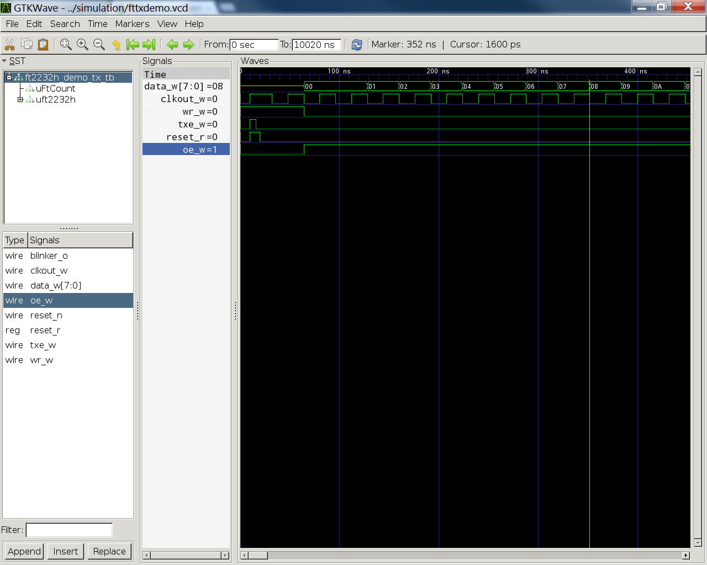

   Results of the FT2232H counter simulation

Top Level Module Design
***********************
All FPGA designs begin with a top-level module. The top-level module has the job of linking all the
submodules and connecting all the relevant signals.  
In our case we want to connect the ft2232h_count_streamer to our *real* ft2232h ic.
This is why our top-level module declares all the signals that we expect to connect to pins
and then to the FT2232H IC.

.. code-block:: verilog
        :linenos:

        module fttxdemo(
            input wire clk_i, // 12MHz from MCU
            input wire uclk_i,  // 60MHz from FT2232H
            output wire [1:0] blinker_o,
            input wire txen_i,
            output wire wr_o, 
            output wire oe_o,
            input wire pwren_i,   
            inout wire [7:0] byte_io    
          );

           wire clk_fast;
           //wire reset_w;
                reg [25:0] cnt_r = 'b0;

                
                always @(posedge clk_fast) begin
                        cnt_r = cnt_r+1;
                end
                
                
           // DCM_SP: Digital Clock Manager Circuit
           //         Spartan-3A
           // Xilinx HDL Language Template, version 14.1
           // 12MHz * 32 /2 = 192MHz
           DCM_SP #(
              .CLKFX_DIVIDE(2),   // Can be any integer from 1 to 32
              .CLKFX_MULTIPLY(32) // Can be any integer from 2 to 32
           ) DCM_SP_inst (      
              .CLKFX(clk_fast),   // DCM CLK synthesis out (M/D)      
              .CLKIN(clk_i),   // Clock input (from IBUFG, BUFG or DCM)      
              .RST(0)        // DCM asynchronous reset input
           );
           // End of DCM_SP_inst instantiation

                ft2232h_count_streamer uftcount(
              .clk_i(uclk_i),
              .adbus_o(byte_io),
              .txe_i(txen_i),
              .wr_o(wr_o),
              .oe_o(oe_o),
              .rst_i(reset_w),
              .blinker_o(blinker_o[0])
            );

           assign reset_w = pwren_i;

                assign blinker_o[1] = cnt_r[22];
                //assign blinker_o[0] = cnt_r[31];
        endmodule

I borrowed and learned from the USRP FPGA build system for the build system on the Platypus DAQ.    
For more details on how you can generate Xilinx projects and utilize the commandline tools see :doc:`buildinst`.

In additon to the top level module we must declare which pins on the FPGA are connected to which signals in the design.
This is done with the ``fttxdemo.ucf`` file.::

        net clk_i	loc=p43;        # 12 MHz clock from pic  
        net blinker_o[1] loc=p35;       # CHAN15: LED Output from counter
        net blinker_o[0] loc=p34;       # CHAN16: LED Output alive
        net uclk_i  loc=p44;            # CHAN-CLK: 60MHz USB Fifo clock
        net txen_i loc=p68;             # CHAN9: TXE#
        net wr_o	loc=p37;        # CHAN1: WR#
        net oe_o    loc=p12;            # CHAN23: OE#
        net pwren_i loc=p13;            # CHAN22: PWREN#
        net byte_io[7] loc=p73;         # CHAN11
        net byte_io[6] loc=p72;         # CHAN10
        net byte_io[5] loc=p62;         # CHAN8
        net byte_io[4] loc=p61;         # CHAN7
        net byte_io[3] loc=p57;         # CHAN6
        net byte_io[2] loc=p56;         # CHAN5
        net byte_io[1] loc=p52;         # CHAN4
        net byte_io[0] loc=p50;         # CHAN3

To simply make the FT2232H transmit counter demo run the following command:

.. code-block:: bash

        $ make -f Makefile.fttxdemo bin

It should build the ``build\fttxdemo.bit`` file for flashing the Spartan 3 FPGA.
If you followed the instruction in the :doc:`buildinst` then programming the XULA is as easy as typing:

.. code-block:: bash

        $ make -f Makefile.fttxdemo progxula

Sourcing a FT2232H for Prototpying
**********************************
For development a FT2232H with supporting circuitry was needed. 
The nice folks over at `Dangerous Prototypes <http://dangerousprototypes.com/>`_ designed a nifty
`breakout board <http://dangerousprototypes.com/docs/FT2232_breakout_board>`_.  
DangerousPrototypes makes all of their devices available at `Seed Studio <http://www.seeedstudio.com>`_. 
The device is available 
`here <http://www.seeedstudio.com/depot/ft2232h-usb-20-hispeed-breakout-board-p-737.html?cPath=175_177>`_.

Putting the FT2232H into FT245 Mode
***********************************
The FT2232H IC stores configuration data in an EEPROM.  

*TODO*: For now I will be using Windows 7 to configure the FT2232H.  There is a utility with libftdi
that *may* be able to program the EEPROM.  When I have time I will look into it.

FTDI provides a utility for programming the EEPROM 
`FTDI EEPROM Programming Utility <http://www.ftdichip.com/Support/Utilities.htm>`_.  
For the Platypus DAQ  it is necessary to use the high speed FT245 Mode of the FT2232H, and you *must* 
program the EEPROM for the chip to use this mode.  The FT2232H normally has two UARTs, so you might be tempted
to use one port in FT245 mode and the other in UART mode, *this is not possible* as FT245 mode uses
resources from each of the *ports*.  This should be *noted* as programming the FPGA 
will require another device, and our future hardware design will have to take this into account.
`FT_Prog <http://www.ftdichip.com/Support/Utilities/FT_Prog%20v2.6.8.zip>`_ is a windows utility. 
You are required to install the `D2XX drivers <http://www.ftdichip.com/Drivers/D2XX.htm>`_ 
for FT_Prog to work correctly. Assuming you successfully installed the driver and have access
to the FT_Prog executable, make sure you FT2232H breakout board in plugged in.

When the FT2232H breakout board is plugged in the PWR led while be on.  Run the program and you will see an empty window as in :ref:`ftprognoscan`. 

.. _ftprognoscan:
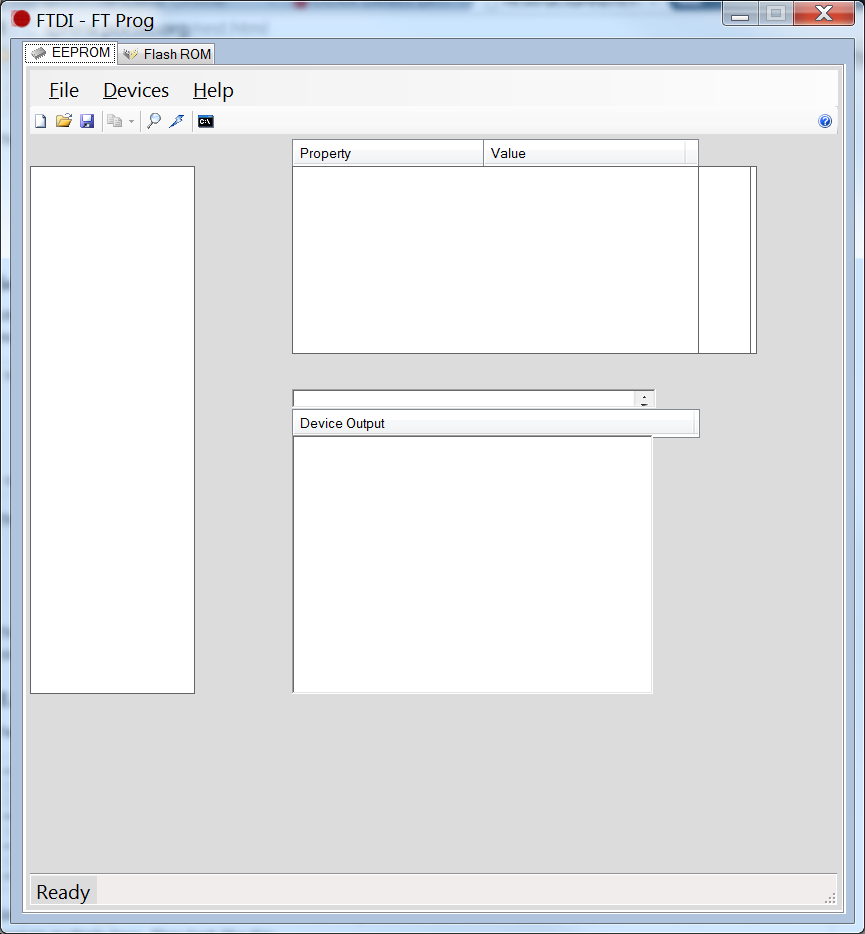

   The FT_Prog should start up without any error.  Make sure the FT2232H Board in plugged in. Initially, the window will be empty.

:ref:`ftprogstartup`

.. _ftprogstartup:
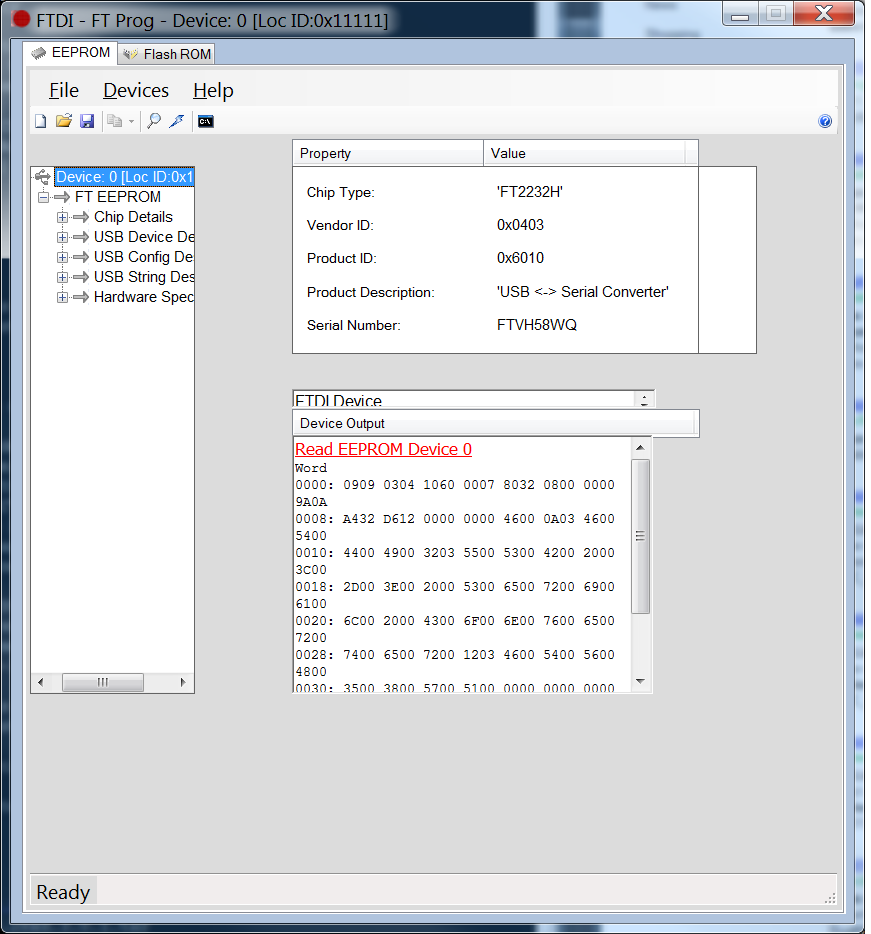

   Selecting the magnifing glass will initiate a hardware scan and read the contents of the EEPROM and parse them for the current configuration.

Next, FT245 mode must be selected.  In the tree on the left drill down from the root selecting FT EEPROM -> Hardware Specific -> Port A -> Hardware.  
:ref:`ftprog245`.

.. _ftprog245:
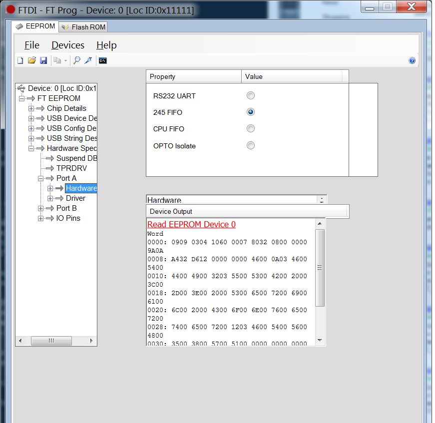

   Select 245 FIFO mode using the radio button.

Programming the EEPROM with the new configuration is accomplished selecting the tiny thunderbolt icon and clicking **Program** on the dialog box that appears.

.. _ftprogprog:
.. figure:: ../img/FT_Prog_Program.png
   :scale: 80 %
   :alt: FT_Prog.exe program the eeprom

   Program the EEPROM

The hardware is now ready to use synchronous FT245 mode.  

You should test to see if the board is in synchronous FIFO mode, you can do this easily if you have a logic analyzer or a oscilliscope.
If you choose to use an oscilliscope make sure it has the `necessary bandwidth <http://en.wikipedia.org/wiki/Nyquist_frequency>`_ to capture a 60MHz signal.
The astute reader will recognize that I am using the `Rigol DS1052 <http://www.rigolna.com/products/digital-oscilloscopes/ds1000e/ds1052e/>`_  with only a 50MHz bandwidth.
You would be right except that we `updated the firmware so that the scope has a larger 100 MHz bandwidth. <http://www.youtube.com/watch?v=LnhXfVYWYXE>`_.
Testing can be done by looking at the clock output pin. :ref:`ft2232hclkpinbot`. :ref:`ft2232hclkpintop`  

.. _ft2232hclkpinbot:
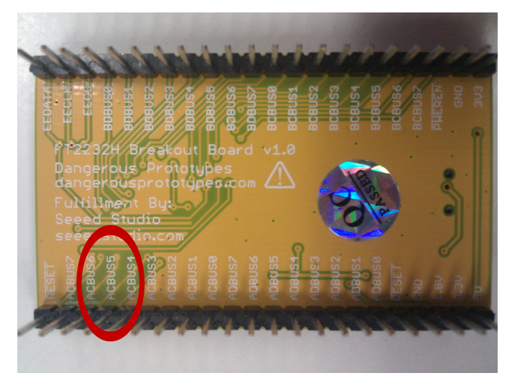

   Identifying the synchronous clock out pin from the bottom. The pin labeled ACBUS5. 

.. _ft2232hclkpintop:   
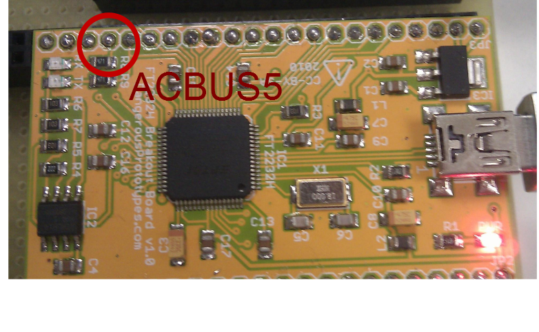

   Looking at the breakout board, the synchronous clock pin is fourth pin from the top.

.. _ft2232h60MHzosc:   
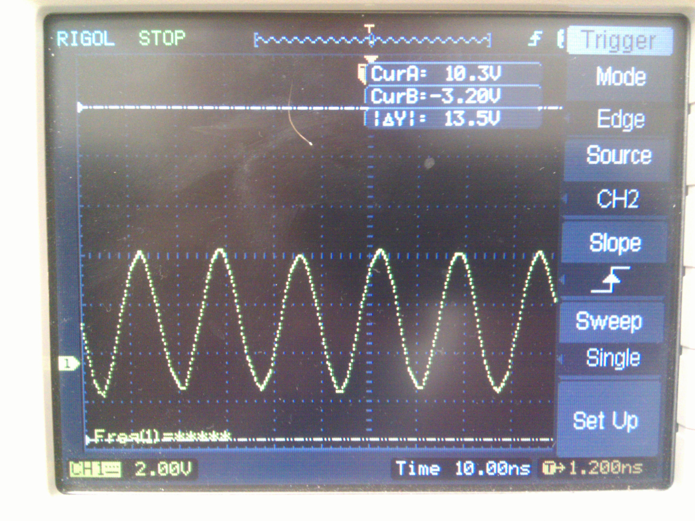

   The 60MHz clock signal is clearly visible.

Hook up an ocsilliscope to pin the high speed clock output. :ref:`ft2232h60MHzosc`

When you first hook up the FT2232H breakout board to your scope and plug it in, you maybe surprised to see *nothing*.  
**DON'T PANIC** you need to connect to the board and start streaming data for the clock to start.  
  the libftdi library comes with a nice litte example "stream_test" run this file from the commandline::

.. code-block:: bash

        $ ./stream_test

Of course there is NO data to stream but, the minute your run the program you should see the 60MHz clock out signal
on your capture device.

Connecting the FT2232H Breakout to the XULA
*******************************************
:ref:`ft2232hdemopinassignment`

.. _ft2232hdemopinassignment:   
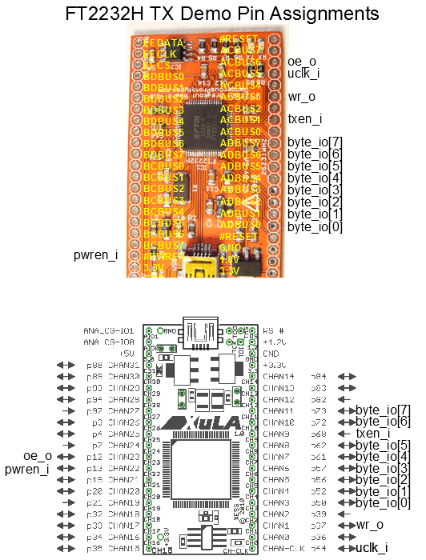

   The diagram shows how to correctly connect the pins of the XULA FPGA to the FT2232H Breakout board.

.. _ftconnect0:   
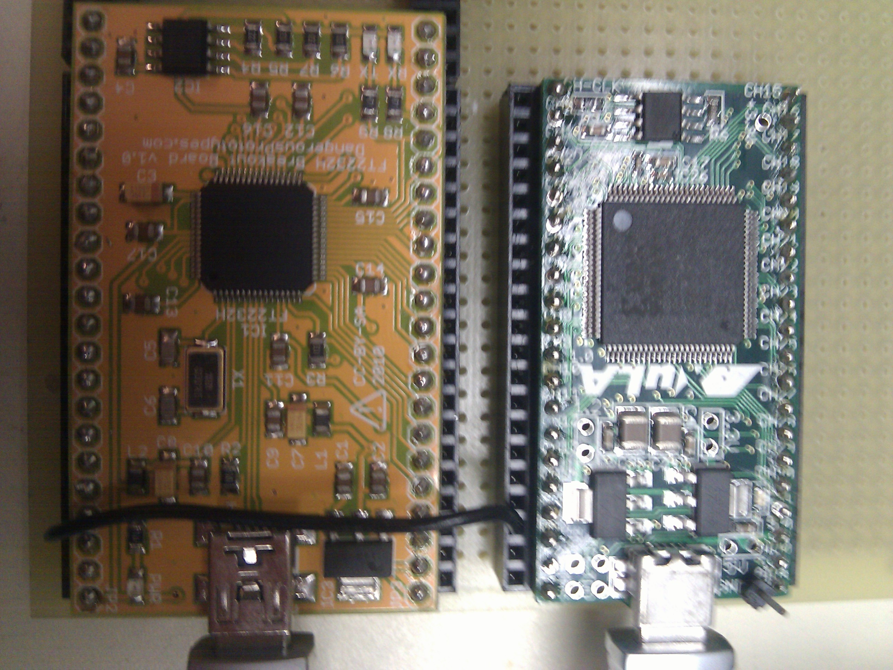

   Connect FT2232H ground to XULA

.. _ftconnect1:   
.. figure:: ../img/XULA2FT2232H-3.jpg
   :scale: 20 %
   :alt: FT2232H Connect control signals to XULA 

   Connect FT2232H control singals to XULA

.. _ftconnect1:   
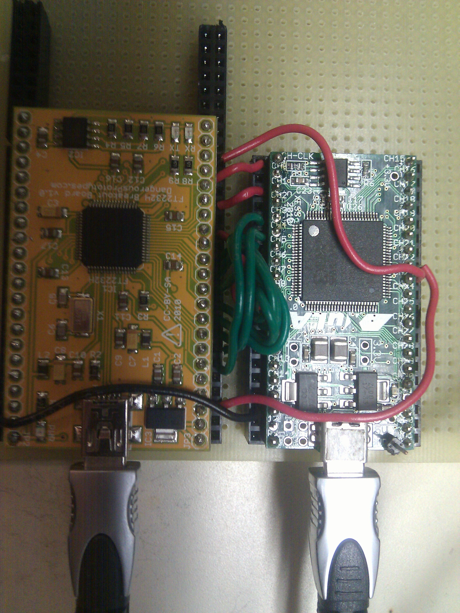

   Connect FT2232H data singals to XULA

Putting it All Together
***********************
This is the point where we get to see how all of our hard work has paid off.
At this point you should have your XULA wired into you FT2232H breakout.

The plan is to first flash the XULA with our ``fttxdemo`` design.
Then, make a fifo named ``data`` (FIFOs are also called a named pipes).
The ``stream_test`` program will then be used write data into our ``data`` fifo.
I have included a python file that will read from the ``data`` fifo and print the results to screen:

.. code-block:: python
        :linenos:

        #!/usr/bin/env python
        import os
        import sys
        import argparse

        parser = argparse.ArgumentParser(description='Read data from counter file and print to screen',
                                        epilog='Intended for use with FT2232H TX Demo')

        parser.add_argument('infile', nargs=1, type=argparse.FileType('r'))

        args = parser.parse_args()

        f = args.infile[0]

        while True:
            val = f.read(1)
            if val:
                print ord(val)
            else:
                break

        print "Reached end of file"

First lets make a fifo:

.. code-block:: bash

        $ mkfifo data

Now we start our ``stream_test`` program:

.. code-block:: bash

        $ stream_test -n data

Finally, to see the data streaming from the FPGA to the FT2232H over the usb port into the ``data`` fifo.
Run the following command:

.. code-block:: bash
        
        $ python readcounter.py data

        
The result will be an ever incrementing number continuously being printed to the screen.
When the number reaches 255 it will overflow and return to 0.

I made a `video <http://youtu.be/Y7IGE4g19gI>`_ showing the data streaming from the FPGA counter.

